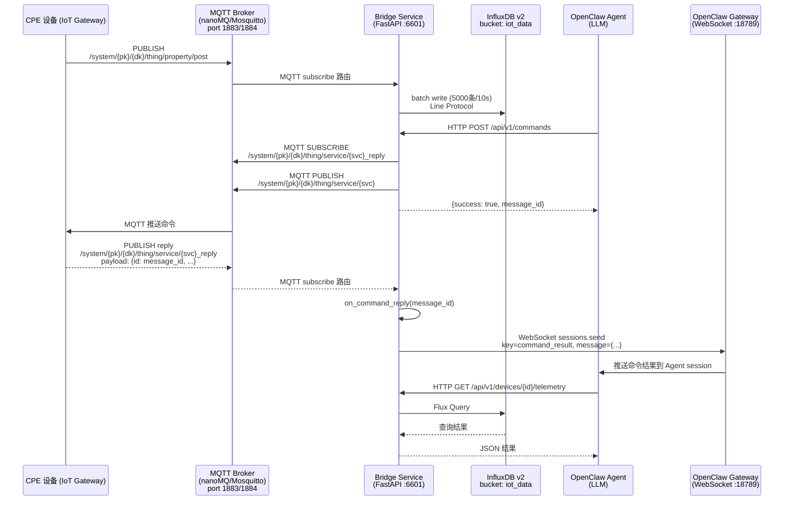
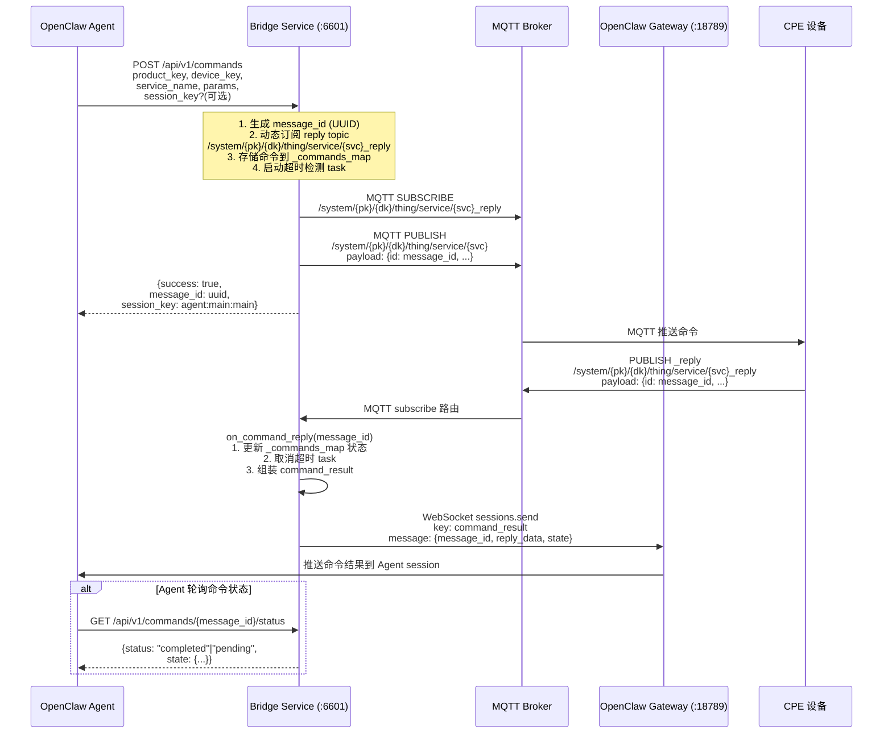

# MQTT-InfluxDB Bridge 用例实现流程

本文件描述 `usecase/1.mqtt_influxdb` 的完整实现架构、各组件协作关系，以及与九井云 IoT 设备数据采集和控制相关的所有接口。

**文档性质：** 当前实现事实（非设计目标或未来规划）

---

## 一、场景视图

### 1.1 系统上下文



### 1.2 九井云 Topic 格式

| 类型 | Topic 格式 | 方向 | 说明 |
|------|------------|------|------|
| 属性上报 | `/system/{productKey}/{deviceKey}/thing/property/post` | CPE → 平台 | 设备周期上报状态/遥测数据 |
| 服务命令 | `/system/{productKey}/{deviceKey}/thing/service/{serviceName}` | 平台 → CPE | 如 `SetDeviceName`、`RebootDevice` |
| 命令回复 | `/system/{productKey}/{deviceKey}/thing/service/{serviceName}_reply` | CPE → 平台 | 设备处理完命令后响应，内容包含 `{id: message_id}` |

### 1.3 命令同步流程（WebSocket 直连推送）

> **关键：reply topic 动态订阅** — `send_command` 被调用时，Bridge 先动态订阅 reply topic（`/system/{pk}/{dk}/thing/service/{svc}_reply`），再发布命令到设备。reply topic **从不 unsubscribe**（原因：同 device+service 并发命令共享同一条 reply topic，回复在 payload.id 中区分，而非 topic 中）。



### 1.4 多会话隔离

| 功能 | 状态 | 说明 |
|------|------|------|
| per-command session_key | ✅ 支持 | `CommandRequest.session_key` 可选传入，未传时使用配置默认值 `agent:main:main` |
| 动态 reply topic 订阅 | ✅ 支持 | `send_command` 在发布命令前动态订阅 reply topic（第 194 行） |
| 命令结果推送到正确 session | ✅ 支持 | `on_command_reply` 从 `_commands_map` 取出对应 session_key，通过 `sessions.send` 推送到正确 Agent session |
| 命令状态持久化 | ✅ 支持 | `_commands_map` 持久化到 `data/commands.json`，重启后命令状态不丢失 |
| 超时检测 | ✅ 支持 | 每个命令启动独立的 asyncio timeout task，超时后主动推送 timeout 状态 |

### 1.5 不支持项

| 项目 | 状态 | 说明 |
|------|------|------|
| 路径③（Hook 注入） | ❌ 不支持 | 需要 before_tool_call Hook + 工具注册 |
| 路径 P（Plugin 扩展） | ❌ 不支持 | 可替代 Bridge + Hook 整套链路 |
| 路径 D（Command Queue） | ❌ 不支持 | Agent poll 模式，无需 sessionKey |
| Reply Topic unsubscribe | ❌ 不执行 | MQTT reply topic 动态订阅但从不 unsubscribe，原因：同 device+service 并发命令共享同一条 reply topic，回复在 payload.id 中区分而非 topic 中；MQTT Broker 订阅效率高，无需引用计数 |

---

## 二、逻辑视图

### 2.1 职责边界

| 组件 | 职责 | 关键类/模块 |
|------|------|------------|
| `src/main.py` | FastAPI + uvicorn 入口；组件初始化与生命周期管理 | `MqttClient`, `InfluxDBWriter`, `InfluxDBQuery`, `WebSocketClient` |
| `src/ws_client.py` | WebSocket 客户端；封装 connect / reconnect / sessions.send；接收命令结果的推送 | `WebSocketClient`, `sessions.send` |
| `src/adapters/` | 协议适配器层；根据 payload 格式路由到不同解析器 | `jiujingyun.py`（九井云协议）, `simple.py`, `router.py` |
| `src/mqtt/client.py` | paho-mqtt 同步回调客户端；MQTT 连接、订阅、自动重连；reply 消息通过 `run_coroutine_threadsafe` 转发到主 asyncio loop | `_on_connect`, `_on_message`, `_on_disconnect` 回调 |
| `src/mqtt/handler.py` | MQTT 消息处理；JSON payload → `TelemetryMessage`（延迟导入以避免循环依赖） | `create_message_handler()` |
| `src/influxdb/writer.py` | 批量写入；5000条或10秒刷新；运行时状态：batching queue | `write()`, batch flush |
| `src/influxdb/query.py` | Flux 查询构建与执行 | `InfluxDBQuery` |
| `src/api/routes.py` | FastAPI 路由；REST API 端点定义；命令状态管理（`_commands_map`, `_timeout_task_map`） | `/health`, `/api/v1/devices`, `/api/v1/commands` |
| `src/models/` | Pydantic v2 数据模型 | `TelemetryMessage`, `CommandRequest` |
| `src/config.py` | YAML + 环境变量配置加载 | `load_config()`, `OpenClawConfig` |

### 2.2 静态依赖

```
main.py
├── config.py (配置加载)
├── mqtt/client.py (MQTT 客户端)
├── influxdb/writer.py (批量写入)
├── influxdb/query.py (查询)
├── api/routes.py (HTTP 路由)
└── ws_client.py (WebSocket 客户端)
    └── config.py → OpenClawConfig
```

### 2.3 OpenClaw Skill 包

#### iot-mqtt-bridge

```
openclaw/iot-mqtt-bridge/
├── SKILL.md                 # 技能入口（trigger: 查询设备/下发命令）
├── references/
│   ├── tools.md            # 工具参数定义
│   ├── agent-guidelines.md  # Agent 使用建议
│   └── jiujingyun-protocol.md # 九井云协议参考
└── scripts/
    └── adapter.sh           # 封装 curl 调用 Bridge API
```

#### influxdb-query

```
openclaw/influxdb-query/
├── SKILL.md
├── references/
│   ├── data-model.md      # 数据模型
│   ├── flux-examples.md   # Flux 查询示例
│   └── tools.md           # 工具参数
└── scripts/
    └── flux_query.sh      # 执行 Flux 查询
```

---

## 三、开发视图

### 3.1 代码组织

```
usecase/1.mqtt_influxdb/
├── src/
│   ├── main.py              # FastAPI 入口（uvicorn）
│   ├── config.py            # YAML + pydantic-settings
│   ├── lineprotocol.py      # InfluxDB Line Protocol 编码器
│   ├── ws_client.py         # WebSocket 客户端（sessions.send 直连推送）
│   ├── mqtt/
│   │   ├── client.py        # asyncio-mqtt 客户端
│   │   └── handler.py       # 消息处理
│   ├── influxdb/
│   │   ├── writer.py        # 批量写入（5000条/10s）
│   │   └── query.py         # Flux 查询
│   ├── api/
│   │   ├── routes.py        # FastAPI 路由
│   │   └── models.py        # API 请求/响应模型
│   ├── models/
│   │   └── telemetry.py     # TelemetryMessage Pydantic 模型
│   └── adapters/
│       ├── base.py         # 适配器基类
│       ├── router.py       # 协议路由
│       ├── jiujingyun.py   # 九井云协议解析
│       └── simple.py        # 简单格式解析
├── openclaw/
│   ├── iot-mqtt-bridge/     # 查询 + 下发控制 skill
│   └── influxdb-query/      # 直接查询 InfluxDB skill
├── scripts/
│   ├── start/               # 服务启动脚本
│   ├── init/                 # InfluxDB 初始化
│   ├── test/                 # 冒烟测试
│   └── test_data/            # 测试数据生成
└── config.yaml
```

### 3.2 构建与依赖

| 操作 | 命令 |
|------|------|
| 安装依赖 | `uv sync` |
| 运行 Bridge | `uv run python -m src.main` |
| 冒烟测试 | `bash scripts/test/smoke.sh` 或 `bash scripts/test/jiujingyun_smoke_test.sh` |
| pytest | `pytest tests/ -v` |

---

## 四、接口视图

### 4.1 REST API 端点

| 端点 | 方法 | 功能 | 备注 |
|------|------|------|------|
| `/health` | GET | 服务健康状态 | 返回 mqtt_connected, influxdb_connected |
| `/api/v1/devices` | GET | 列出所有已知设备 ID | — |
| `/api/v1/devices/{device_id}/telemetry` | GET | 查询设备时序遥测数据 | 支持 ?start=?end=?limit= 参数 |
| `/api/v1/devices/{device_id}/status` | GET | 查询设备最新状态 | — |
| `/api/v1/commands` | POST | 向设备下发 MQTT 控制命令 | **已实现 WebSocket 直连推送** |
| `/api/v1/commands/{message_id}/status` | GET | 查询命令执行状态 | 返回 pending/completed + state |
| `/api/v1/query` | POST | 原始 Flux/InfluxQL 查询 | 兼容保留 |

### 4.2 send_command 接口契约

**请求：**
```json
POST /api/v1/commands
{
  "product_key": "test-product",
  "device_key": "test-device-001",
  "service_name": "SetDeviceName",
  "params": {"deviceName": "new-name"},
  "session_key": "agent:main:main"  // 可选，不传则使用配置默认值
}
```

**响应：**
```json
{
  "success": true,
  "message_id": "uuid-xxx",
  "topic": "/system/test-product/test-device-001/thing/service/SetDeviceName",
  "payload": "{...}",
  "session_key": "agent:main:main"
}
```
（无 `taskflow_created` 字段，命令结果通过 WebSocket sessions.send 主动推送）

### 4.3 命令状态查询

```
GET /api/v1/commands/{message_id}/status
响应：{ "status": "completed", "state": {...} }
```

---

## 五、进程视图

### 5.1 并发模型

| 组件 | 模型 | 说明 |
|------|------|------|
| MQTT Client | paho-mqtt 同步回调 + asyncio.run_coroutine_threadsafe 跨线程转发 | `_reply_queue` 在代码中不存在；reply 由 `_on_message` 直接通过 `run_coroutine_threadsafe` 调度到主 loop |
| InfluxDB Writer | 后台线程 + queue | batching queue，5000条或10秒刷新 |
| FastAPI | asyncio + uvicorn | 同步命令下发 + 异步 WebSocket 推送 |
| Reply Consumer | 后台线程消费 `_reply_queue` | 调用 `handle_command_reply()` → `on_command_reply()` → `sessions.send` 推送 |

### 5.2 关键状态

| 状态 | 位置 | 说明 |
|------|------|------|
| `mqtt_connected` | `mqtt.client.MqttClient` | MQTT 连接状态（`is_connected()` 方法） |
| `influxdb_connected` | `influxdb.writer.InfluxDBWriter` | InfluxDB 连接状态（`_connected` 属性） |
| `_commands_map` | `api.routes` | message_id → 命令状态映射（status, product_key, device_key, service_name, params, session_key, topic, created_at, reply_data） |
| `_timeout_task_map` | `api.routes` | message_id → asyncio.Task 映射（超时检测） |

---

## 六、启动顺序

详见 `scripts/README.md`：

```bash
# Terminal 1: InfluxDB v2
bash scripts/start/influxdb.sh
bash scripts/init/influxdb_v2.sh

# Terminal 2: MQTT Broker
NANOMQ_TCP_PORT=1884 bash scripts/start/nanomq.sh   # 或 start_mosquitto.sh

# Terminal 3: Bridge Service
MQTT_BROKER=tcp://127.0.0.1:1884 BASE_URL=http://localhost:6601 bash scripts/start/bridge.sh

# Terminal 4 (可选): OpenClaw Gateway（WebSocket 直连推送）
# 在对应 workspaces/<name>/ 目录下：
# export OPENCLAW_STATE_DIR="$(pwd)"
# openclaw gateway --port 18789

# Terminal 5: 冒烟测试
MQTT_HOST=127.0.0.1 MQTT_PORT=1884 bash scripts/test/jiujingyun_smoke_test.sh
```

---

## 七、冒烟测试

### 7.1 基础冒烟测试

```bash
MQTT_HOST=127.0.0.1 MQTT_PORT=1884 BASE_URL=http://localhost:6601 \
bash scripts/test/smoke.sh
```

### 7.2 九井云协议测试

```bash
MQTT_HOST=127.0.0.1 MQTT_PORT=1884 \
BASE_URL=http://localhost:6601 \
PRODUCT_KEY=test-product \
DEVICE_KEY=test-device-001 \
bash scripts/test/jiujingyun_smoke_test.sh
```

**测试步骤：**

1. **健康检查** — 验证 Bridge、MQTT、InfluxDB 连接状态
2. **发布属性上报** — 发送九井云格式的 `thing.property.post` MQTT 消息
3. **等待批量写入** — 等待 5 秒让 Bridge 将数据写入 InfluxDB
4. **查询设备列表** — 验证设备已被记录
5. **查询设备遥测** — 验证遥测数据已存储
6. **下发控制命令** — 通过 HTTP API 发送 `SetDeviceName` 命令（模拟 Agent）
7. **验证 Skill 集成** — 使用 `adapter.sh` 做端到端验证

---

## 八、验证清单

| 验证项 | 验证方法 |
|--------|----------|
| Bridge 服务健康 | `curl http://localhost:6601/health` |
| MQTT 连接正常 | 查看 health 响应中 `mqtt_connected: true` |
| InfluxDB 连接正常 | 查看 health 响应中 `influxdb_connected: true` |
| 设备数据写入 | `bash scripts/test/jiujingyun_smoke_test.sh` |
| Skill adapter 可用 | `bash openclaw/iot-mqtt-bridge/scripts/adapter.sh health` |
| 命令下发成功（同步模式） | 检查 `send_command` 返回 `success: true` |
| WebSocket 命令推送 | 观察 Bridge 日志中 `sessions.send` 调用；`GET /api/v1/commands/{id}/status` 返回 completed |

---

## 九、容量规格（待确认）

以下规格当前只有代码默认值，无正式产品承诺：

| 规格 | 当前实现值 | 说明 |
|------|-----------|------|
| 批量写入阈值 | 5000 条 | 触发批量写入的点数阈值 |
| 批量刷新间隔 | 10 秒 | 强制刷新的时间间隔 |
| HTTP 请求超时 | 30 秒 | `WsClient` 连接超时配置 |
| MQTT 重连策略 | 指数退避 | MQTT client auto-reconnect |
| InfluxDB 最大查询条数 | limit 参数控制 | 默认 1000 条（可配置） |